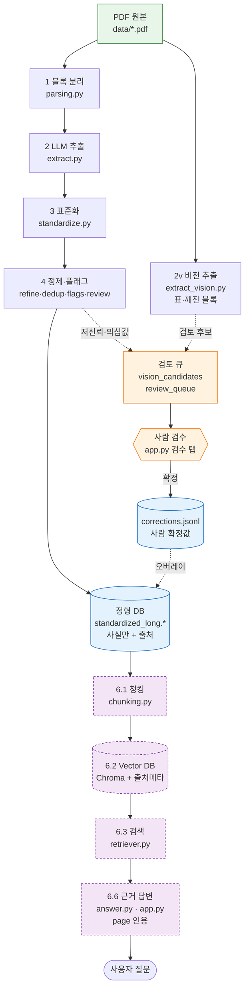

# 대한민국 친환경 소비 인지도 실시간 신호등

> **k-green-signal** — 매년 발간되는 「친환경 생활·소비 국민 인지도 조사」 결과보고서(PDF)를
> **근거 기반(grounded) 정형 데이터셋**으로 통합하고, 그 위에서 친환경 소비 인지도의
> 변화를 **신호등처럼** 읽어내는 것을 목표로 합니다.

<p>
  
  
  
  
  
</p>

---

## 개요 (Overview)

매년 나오는 인지도 조사 보고서는 **해마다 문항 표현·응답 척도·표기 형식이 달라서**
연도 간 비교가 어렵습니다. `k-green-signal`은 이 비정형 PDF들을 읽어
**문항을 표준화하고 '전체(국민 전체)' 기준 핵심 수치를 출처와 함께 추출해**,
연도 비교가 가능한 하나의 tidy 데이터셋으로 통합합니다.

- **대상**: 총 14개년 (2007, 2013~2025) — 현재 **2023~2025** 3개년 구축
- **추출 범위**: 우선 **'전체' 핵심 수치**만 (성별·연령 등 하위집단 교차표는 추후)
- **산출물**: 표준 문항 사전 + 연도 통합 Long-format CSV + (예정) 근거 검색·답변

### ★ 설계 원칙 — "추측은 데이터가 아니다"

상용 문서 AI(NotebookLM·ChatGPT·Gemini·Claude) 조사를 바탕으로 한 핵심 원칙:

1. **문서에 실제로 있는 것만** 출처(page·표번호·구절)와 함께 DB에 넣는다.
2. LLM·휴리스틱의 **불확실한 판단은 데이터가 아니라 '검토 대기'**로만 남기고,
   사람이 원문을 보고 확정한 것만 데이터가 된다.
3. 답변/판별은 그 **출처(grounding)에 근거**한다 — 근거가 없으면 "찾을 수 없음".

전체 목표 아키텍처는 [`ARCHITECTURE.md`](./ARCHITECTURE.md) 참고.

---

## 아키텍처 (Architecture)



> **실선** = 확정 데이터 흐름 · **점선** = 검토(추측 격리) 흐름 · **보라(점선 테두리)** = 6단계 RAG(예정).
> 핵심: 비전·휴리스틱 결과는 곧장 정형 DB에 들어가지 않고 **검토 큐 → 사람 확정 → corrections** 를 거친다.

---

## 파이프라인 (Pipeline)

데이터는 다음 단계를 거쳐 흐릅니다. 각 단계는 독립 실행·검수가 가능합니다.

| 단계 | 모듈 | 하는 일 | 상태 |
|---|---|---|---|
| **0. 진단** | `rag/ingestion.py` | PDF가 디지털 텍스트인지 진단 | ✅ |
| **1. 블록 분리** | `rag/parsing.py` | 본문을 문항 단위로 분리(출처·페이지 부착) | ✅ |
| **2. LLM 추출** | `rag/extract.py` | 블록 원문 → 구조화 레코드 (Structured Outputs) | ✅ |
| **2v. 비전 추출** | `rag/extract_vision.py` | **표가 깨진 블록은 페이지 이미지를 멀티모달로 판독** | ✅ |
| **3. 표준화** | `rag/standardize.py` | 연도별 문항을 표준 문항 ID로 통합 → Long CSV | ✅ |
| **4. 정제·통합** | `rag/refine·dedup·flags·review.py` | 라벨 표준화·중복 분리·의심값 플래그·검수 큐 | ✅ |
| **5. 검수 UI** | `app.py` + `rag/corrections.py` | 저신뢰 행을 사람이 원문과 대조·수정 → `corrections.jsonl` | ✅ |
| **6. RAG 검색** | `rag/chunking·index·retriever·answer.py` | 정형 데이터 위 **근거 인용 질의응답** | ⏳ |

> 단계별 세부 체크리스트는 [`plan.md`](./plan.md) 참고.

### 왜 비전 추출인가
보고서의 표는 2단(좌우) 배치가 많아, `PyMuPDF` 텍스트 추출로 펼치면 **열이 뒤섞이고
라벨–값이 분리**됩니다(빈칸·오정렬·행 누락). 그래서 표 블록은 **페이지를 이미지로 렌더링해
멀티모달 모델로 판독**합니다 — Claude/Gemini가 PDF를 비전으로 읽는 방식의 경량판.
단, 비전 결과도 **자동 반영하지 않고 검토 후보(`outputs/vision_candidates.csv`)로만** 두어
사람이 확정합니다(설계 원칙).

---

## 모듈 구조

```
k-green-signal/
├── app.py                  # Streamlit: "문서 Q&A" 탭 + "검수" 탭
├── ARCHITECTURE.md         # 목표 아키텍처 설계서 (5레이어)
├── plan.md                 # 단계별 진행 계획
├── rag/
│   ├── config.py           # 모델 중앙 설정 (한 곳에서 교체)
│   ├── ingestion.py        # 0 문서 진단
│   ├── parsing.py          # 1 문항 블록 분리
│   ├── extract.py          # 2 LLM 구조화 추출
│   ├── extract_vision.py   # 2v 비전(이미지) 추출
│   ├── refill_vision.py    # 빵구 블록 비전 재추출 → 검토 후보 생성(candidate 모드)
│   ├── standardize.py      # 3 문항 표준화 + 통합 CSV
│   ├── refine.py           # 4.1 응답 라벨 표준화
│   ├── dedup.py            # 4.2 중복 제거 / 과잉병합 분리
│   ├── flags.py            # 4.3 의심값 자동 플래그
│   ├── review.py           # 4.4 저신뢰 검수 큐
│   └── corrections.py      # 5 검수 보정 I/O (corrections.jsonl)
├── data/                   # 입력 PDF (gitignore)
└── outputs/                # 산출물: jsonl / 사전 / CSV / chroma (gitignore)
```

각 문항 레코드가 보존하는 메타데이터:
`source` · `page` · `section` · `subsection` · `question_summary` ·
`response_items[{label, value}]` · `base_n` · `unit` · `multi_response` ·
`figures` · `extraction_confidence` · `warning`

---

## 빠른 시작 (Quick Start)

```bash
# 1) 의존성 설치 (uv)
uv sync

# 2) .env 에 API Key 설정 →  OPENAI_API_KEY=sk-...

# 3) 단계별 실행
uv run python rag/ingestion.py                              # 0 진단
uv run python rag/parsing.py "data/<파일>.pdf" 5             # 1 블록 분리 확인
uv run python rag/extract.py "data/<파일>.pdf" 999 --save    # 2 전체 추출
uv run python rag/standardize.py                            # 3 표준화 → 통합 CSV
uv run python rag/refine.py && uv run python rag/dedup.py \
  && uv run python rag/flags.py && uv run python rag/review.py   # 4 정제·검수큐

# 4) 앱 실행 (문서 Q&A + 검수 탭)
uv run streamlit run app.py
```

> 보안: API Key는 **`.env`에서만** 읽으며 코드에 직접 쓰지 않습니다.

---

## 주요 설정 (Key Configuration)

모델은 [`rag/config.py`](./rag/config.py) 한 곳에서 관리합니다 (교체 시 이 파일만 수정).

| 용도 | 모델 |
|---|---|
| 추출 · 표준화 · 답변 · 재작성 · Reranker · 예시질문 · **Vision** | `gpt-5.4-mini` |
| 인덱싱 · 검색 임베딩 | `text-embedding-3-small` |

- **구조화 출력**: OpenAI Structured Outputs (`json_schema`, `strict`)로 환각 억제
- **벡터 DB**(6단계): Chroma
- **출력 인코딩**: 한글 Windows(cp949)에서도 깨지지 않도록 UTF-8 강제

---

## 기술 스택

Python 3.12 · uv · OpenAI (Chat + Vision + Embeddings) · PyMuPDF · pypdf ·
python-docx · Streamlit · ChromaDB · tiktoken · python-dotenv

---

## 진행 상황

- ✅ 0~4단계 (3개년 정형 데이터셋 + 라벨 표준화·중복 분리·의심값 플래그·검수 큐)
- ✅ 5단계 검수 UI (`app.py` 검수 탭 + `corrections.jsonl`) · 다중 파일 업로드
- ✅ 비전 추출(`extract_vision.py`)로 깨진 표 복원 — 검토 후보로 라우팅
- ⏳ 6단계 RAG: 청킹 → Chroma 인덱싱 → 검색 → **근거 인용 답변** ([`ARCHITECTURE.md`](./ARCHITECTURE.md))
