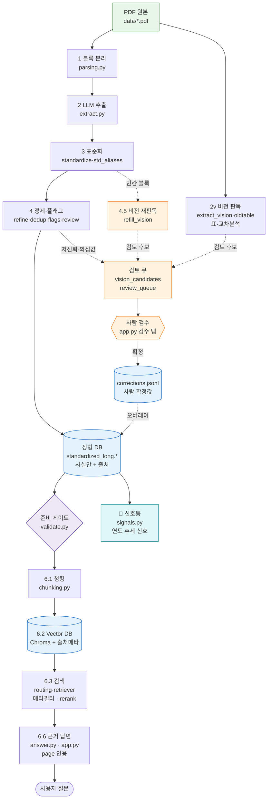

# 대한민국 친환경 소비 인지도 실시간 신호등


**k-green-signal** — 매년 발간되는 「친환경 생활·소비 국민 인지도 조사」 결과보고서(PDF)를 **근거 기반(grounded) 정형 데이터셋**으로 통합하고, 그 위에서 친환경 소비 인지도의 변화를 **신호등처럼** 읽어내는 데이터 파이프라인 + RAG 질의응답 시스템입니다.

> **진행 상황**은 아래 [파이프라인](#파이프라인-pipeline) 표의 상태(✅/⏳)와 [`PLAN.md`](./docs/PLAN.md)를 참고하세요.

---

## 개요 (Overview)

매년 나오는 인지도 조사 보고서는 **해마다 문항 표현·응답 척도·표기 형식이 달라서**
연도 간 비교가 어렵습니다. `k-green-signal`은 이 비정형 PDF들을 읽어
**문항을 표준화하고 '전체(국민 전체)' 기준 핵심 수치를 출처와 함께 추출해**,
연도 비교가 가능한 하나의 tidy 데이터셋으로 통합합니다.

- **대상**: 총 14개년 (2007, 2013~2025) — 현재 **2023~2025** 3개년 구축
- **추출 범위**: 우선 **'전체' 핵심 수치**만 (성별·연령 등 하위집단 교차표는 추후)
- **산출물**: 표준 문항 사전 + 연도 통합 Long-format CSV + 근거 인용 RAG 질의응답 + 🚦 신호등(연도 추세)

### ★ 설계 원칙 — "추측은 데이터가 아니다"

상용 문서 AI(NotebookLM·ChatGPT·Gemini·Claude) 조사를 바탕으로 한 핵심 원칙:

1. **문서에 실제로 있는 것만** 출처(page·표번호·구절)와 함께 DB에 넣는다.
2. LLM·휴리스틱의 **불확실한 판단은 데이터가 아니라 '검토 대기'**로만 남기고,
   사람이 원문을 보고 확정한 것만 데이터가 된다.
3. 답변/판별은 그 **출처(grounding)에 근거**한다 — 근거가 없으면 "찾을 수 없음".

전체 목표 아키텍처는 [`ARCHITECTURE.md`](./docs/ARCHITECTURE.md) 참고.

---

## 아키텍처 (Architecture)



> **실선** = 확정 데이터 흐름 · **점선** = 검토(추측 격리) 흐름 · **🚦 신호등** = 연도 추세 출력 · **6단계 RAG** = 구현 완료.

---

## 파이프라인 (Pipeline)

데이터는 다음 단계를 거쳐 흐릅니다. 각 단계는 독립 실행·검수가 가능합니다.

| 단계 | 모듈 | 하는 일 | 상태 |
|---|---|---|---|
| **0. 진단** | `rag/ingest/ingestion.py` | PDF가 디지털 텍스트인지 진단 | ✅ |
| **1. 블록 분리** | `rag/ingest/parsing.py` | 본문을 문항 단위로 분리(출처·페이지 부착) | ✅ |
| **2. LLM 추출** | `rag/ingest/extract.py` | 블록 원문 → 구조화 레코드 (Structured Outputs) | ✅ |
| **2v. 비전 추출** | `rag/ingest/extract_vision.py` | **표가 깨진 블록은 페이지 이미지를 멀티모달로 판독** | ✅ |
| **3. 표준화** | `rag/transform/standardize.py` | 연도별 문항을 표준 문항 ID로 통합 → Long CSV | ✅ |
| **4. 정제·통합** | `rag/transform/{refine,dedup,flags,review}.py` | 라벨 표준화·중복 분리·의심값 플래그·검수 큐 | ✅ |
| **5. 검수 UI** | `ui/review.py`(스텝퍼 3단계) + `rag/curate/corrections.py` | 저신뢰 행을 사람이 원문과 대조·수정 → `corrections.jsonl` | ✅ |
| **6. RAG 검색** | `rag/retrieval/{chunking,index,routing,retriever,answer}.py` | 정형 데이터 위 **근거 인용 질의응답**(Chroma 벡터검색 → **LLM rerank** → 출처 인용 답변). **두 모드**(`cite` 사실 인용 · `advise` 데이터 기반 제언 — KEEP/ADD/DROP/FIX 다면검색) + **상세도**(요약/표준/상세) + **질문 재작성**(recall↑)·**예시 질문**. 방법론 '비교 유의'·**외부 맥락(그해 사건)** 지식청크도 함께 인덱싱·검색 → advise가 **데이터 변화를 사건과 엮어 상황 해석**(상관·인과 구분) | ✅ 기본 |
| **🚦 신호등** | `rag/signals.py` + `ui/signal.py` | 연도 추세 신호(🟢상승/🟡보합/🔴하락). 의사결정용 **3단 분리** — 🟢설계 동일·크기 정상(바로 판단) · 🔶이례적 급변(>15%p, 검증 필요) · ⚠️개편·척도 변경(해석 유의). 집계·비응답·이진 상보 중복 제외. 단일 연도 문항은 그 해 스냅샷(파레토), '변곡점 × 외부 맥락' 패널 | ✅ |
| **+ 앱/검증** | `app.py` 3모드 · `rag/curate/validate.py`(준비 게이트) · `rag/pipeline.py` · `tests/e2e`(Playwright) | **🚦 대시보드(랜딩)** · 💬 AI에게 묻기 · 🛠 데이터 준비(업로드→인제스트→검수→(게이트)→인덱싱 스텝퍼) + 🩺 시스템 로그 | ✅ |

> 단계별 세부 체크리스트는 [`PLAN.md`](./docs/PLAN.md) 참고.

### 왜 비전 추출인가
보고서의 표는 2단(좌우) 배치가 많아, `PyMuPDF` 텍스트 추출로 펼치면 **열이 뒤섞이고
라벨–값이 분리**됩니다(빈칸·오정렬·행 누락). 그래서 표 블록은 **페이지를 이미지로 렌더링해
멀티모달 모델로 판독**합니다 — Claude/Gemini가 PDF를 비전으로 읽는 방식의 경량판.
(결과는 `outputs/vision_candidates.csv`로만 — 위 설계 원칙대로 검토 후 확정)

---

## 모듈 구조

```
k-green-signal/
├── app.py                          # 진입점 셸(360행): 3모드 라우팅(대시보드/AI에게 묻기/데이터 준비)·상태/🩺 로그 패널 + main()
├── ui/                             # app.py 에서 추출한 UI 패키지(모드·단계 화면 전량 분리)
│   ├── signal.py                   #   🚦 신호등 대시보드 — 랜딩 화면(의사결정 프레이밍)
│   ├── review.py                   #   데이터 준비 3단계 검수(순차 모드·원문 페이지 미리보기) + 비전 후보 + LLM 검증(adjudicate)
│   ├── ingest.py                   #   데이터 준비 1·2단계 업로드·인제스트 화면 + 진행 모니터
│   ├── rag.py                      #   💬 AI에게 묻기(사실 인용/데이터 기반 제언 카드 · 상세도 · 질문 재작성 · 예시 질문 · 출처 카드)
│   ├── index.py                    #   데이터 준비 4단계 인덱싱 화면(준비 게이트)
│   └── common.py                   #   공유 상수·경로(REVIEW_QUEUE_PATH · VISION_CANDIDATES_PATH · DATA_DIR)
├── curation/                       # 커밋되는 사람 큐레이션·검수 입력(설정 아님)
│   ├── external_context.json       #   큐레이션 '외부 맥락'(정책·사건) — 신호등 패널 + parser_type='external_context' 인덱싱
│   ├── methodology_notes.json      #   방법론 '비교 유의' 지식(척도 변경 등) → parser_type='methodology' 인덱싱
│   └── mapping_review.csv          #   과병합 교정 워크시트(사람이 std_id 확정)
├── docs/                           # 설계·기록 문서 (ARCHITECTURE · DECISIONS · PLAN · LOGGING)
├── eval/                           # 평가 질문셋 + 러너 (questions.jsonl · run_eval.py)
├── rag/                            # 서브도메인별 서브패키지 (실행: python -m rag.<pkg>.<mod>)
│   ├── core/                       # 공통 인프라
│   │   ├── config.py               #   전역 모델 설정 (한 곳에서 교체)
│   │   ├── paths.py                #   산출물 경로 단일화 (env override — 테스트 격리)
│   │   └── logging_setup.py        #   공용 로깅 (UTF-8 파일+콘솔, 멱등)
│   ├── ingest/                     # 0~2 진단·파싱·추출(+비전)
│   │   ├── ingestion.py            #   0  문서 진단(디지털 텍스트 여부)
│   │   ├── parsing.py              #   1  문항 블록 분리 (+출처·페이지)
│   │   ├── extract.py              #   2  LLM 구조화 추출 (Structured Outputs · RAG_FAKE_LLM 스텁)
│   │   ├── extract_vision.py       #   2v 표 블록 비전(이미지) 판독
│   │   └── extract_vision_oldtable.py  # 2v 옛 형식(교차분석 표) 비전 판독(→ medium+warning 검수행)
│   ├── transform/                  # 3~4 표준화·정제·검수큐 생성
│   │   ├── standardize.py          #   3  문항 표준화 → 통합 Long CSV
│   │   ├── std_aliases.py          #   3  연도 간 '같은 문항 다른 이름' 별칭 통합·백필
│   │   ├── refine.py               #   4.1 응답 라벨 표준화 (스레드풀 병렬)
│   │   ├── dedup.py                #   4.2 중복 제거 / 과잉병합 분리
│   │   ├── flags.py                #   4.3 의심값 자동 플래그
│   │   └── review.py               #   4.4 저신뢰 검수 큐 생성
│   ├── curate/                     # 사람 확정·복원·비전회수·LLM검증·지식로더·통합·게이트
│   │   ├── refill_vision.py        #   4.5 빈칸 블록 비전 재판독 → 검토 후보(candidate 모드)
│   │   ├── adjudicate.py           #   5  검수 큐 행 LLM 검증(하이브리드 게이트 — 사람 확정 보조)
│   │   ├── corrections.py          #   5  검수 보정 I/O(corrections.jsonl) + 확정값 오버레이
│   │   ├── integrate_oldyears.py   #      옛 연도(비전) 데이터 증분 통합
│   │   ├── methodology.py          #      방법론 '비교 유의' 지식 단일 로더(청킹·앱 캡션 공용)
│   │   ├── external_context.py     #      외부 맥락(그해 사건) 지식 단일 로더(청킹·신호등 공용)
│   │   └── validate.py             #      준비 게이트(빈/미확정/미검수·side-channel 불확실 행이면 차단)
│   ├── retrieval/                  # 6 청킹·인덱싱·검색·답변
│   │   ├── chunking.py             #   6.1 청킹 (사실 청크 + 방법론·외부 맥락 지식청크, 출처 메타·corrections 반영)
│   │   ├── index.py                #   6.2 임베딩 · Chroma 인덱싱
│   │   ├── routing.py              #   6.3 질문→표(std_id) 결정적 라우팅(검색 좁히기)
│   │   ├── retriever.py            #   6.3 벡터 검색 (+메타필터 · LLM rerank)
│   │   └── answer.py               #   6.6 근거 인용 답변 (+6.4 질문 재작성 · 6.7 예시 질문 · 단계별 소요시간, 스텁 지원)
│   ├── signals.py                  # 🚦 신호등 — 연도 추세 신호(순수 함수, LLM 불필요)
│   └── pipeline.py                 #    인제스트 단계를 `python -m` 서브프로세스로 실행+로그 캡처
├── tests/                          # 단위 테스트 + e2e/(Playwright: smoke·stepper·ingest·rag)
├── scripts/                        # bootstrap_samples.py — 클론 후 samples/→작업 폴더 펼침
├── samples/                        # 클론 즉시 재현 레퍼런스: outputs/(CSV·청크·Chroma) 커밋, PDF는 제외
├── data/                           # 입력 PDF (gitignore)
└── outputs/                        # 산출물: jsonl / 사전 / CSV / chroma / runs (gitignore)
```

각 문항 레코드가 보존하는 메타데이터:
`source` · `page` · `section` · `subsection` · `question_summary` ·
`response_items[{label, value}]` · `base_n` · `unit` · `multi_response` ·
`figures` · `extraction_confidence` · `warning`

---

## 빠른 시작 (Quick Start)

### A) 바로 보기 — 클론 → 부트스트랩 → 실행 (권장)

산출물(정형 CSV·청크·**Chroma 인덱스**)을 `samples/` 에 커밋해 두었습니다(원본 PDF는 용량상 제외 —
결과 보기엔 불필요, 출처는 [`samples/data/README.md`](./samples/data/README.md)).
부트스트랩이 이를 작업 폴더로 펼치면 **키 없이도** 신호등 대시보드가 바로 동작합니다
(벡터 검색·답변 생성은 질문 임베딩에 OpenAI 키가 필요합니다).

```bash
git clone https://github.com/mslim-tech/k-green-signal.git && cd k-green-signal
uv sync                                              # 1) 의존성 설치
uv run python scripts/bootstrap_samples.py           # 2) samples/ → data/·outputs/ 로 펼침
uv run streamlit run app.py                          # 3) 앱 실행(신호등은 키 없이 O)
```

> **RAG 검색·답변 생성**은 각자 키가 필요합니다(질문 임베딩·생성 모두 OpenAI 호출):
> `cp .env.example .env` 후 `OPENAI_API_KEY=sk-...` 를 채우세요. 신호등 대시보드는 키 없이 동작합니다.
>
> `data/`·`outputs/` 는 git 이 추적하지 않는 **작업 폴더**입니다(각자 데이터 → 충돌 0). 자기 PDF 로
> 새로 작업하려면 부트스트랩을 건너뛰고 아래 B) 로 진행하세요. 레퍼런스로 되돌리려면
> `uv run python scripts/bootstrap_samples.py --force`.

### B) 처음부터 / 내 데이터로 — 전체 파이프라인

```bash
uv sync                                                            # 의존성 설치
# .env 에 API Key 설정 →  cp .env.example .env  후  OPENAI_API_KEY=sk-...

# 단계별 실행 (data/ 에 자기 PDF 를 두고)
uv run python -m rag.ingest.ingestion                              # 0 진단
uv run python -m rag.ingest.parsing "data/<파일>.pdf" 5             # 1 블록 분리 확인
uv run python -m rag.ingest.extract "data/<파일>.pdf" 999 --save    # 2 전체 추출
uv run python -m rag.transform.standardize                            # 3 표준화 → 통합 CSV
uv run python -m rag.transform.refine && uv run python -m rag.transform.dedup \
  && uv run python -m rag.transform.flags && uv run python -m rag.transform.review   # 4 정제·검수큐

# 준비 게이트 점검 → RAG 인덱스 구축 (청킹 → 임베딩 → Chroma)
uv run python -m rag.curate.validate                                # 인덱싱 가능 여부 점검(차단 항목 표시)
uv run python -m rag.retrieval.chunking && uv run python -m rag.retrieval.index
uv run python -m rag.retrieval.answer "2023년 확대 희망 친환경제품 1위는?"   # (선택) CLI 질의 테스트

# 앱 실행 — 🚦 대시보드 랜딩(💬 AI에게 묻기·🛠 데이터 준비는 상단 모드 버튼으로)
uv run streamlit run app.py
```

### 검증 (E2E 테스트)
구현이 의도대로 동작하는지 Playwright로 확인합니다(서버 자동 기동·종료, `RAG_FAKE_LLM`로 결정적·무료).

```bash
uv run playwright install chromium   # 최초 1회
uv run pytest tests/e2e -v           # smoke · stepper · ingest · rag
```

> 보안: API Key는 **`.env`에서만** 읽으며 코드에 직접 쓰지 않습니다.

---

## 주요 설정 (Key Configuration)

모델은 [`rag/core/config.py`](./rag/core/config.py) 한 곳에서 관리합니다 (교체 시 이 파일만 수정).

| 용도 | 모델 |
|---|---|
| 추출 · 표준화 · 답변 · 재작성 · Reranker · 예시질문 · **Vision** | `gpt-5.4-mini` |
| 인덱싱 · 검색 임베딩 | `text-embedding-3-small` |

- **구조화 출력**: OpenAI Structured Outputs (`json_schema`, `strict`)로 환각 억제
- **벡터 DB**(6단계): Chroma
- **출력 인코딩**: 한글 Windows(cp949)에서도 깨지지 않도록 UTF-8 강제

---

## 개발 (Development)

```bash
uv run ruff check .                  # 린트 (설정: pyproject.toml [tool.ruff])
uv run pytest                        # 단위 + E2E (기본 'not slow' — 무료·결정적)
uv run pytest -m slow                # 실제 OpenAI 호출 테스트만(과금·비결정적)
```

- **코드 품질**: Ruff(린트) · cSpell(`cspell.json` 도메인 사전) · pytest/Playwright
- **설계·결정 기록**: [`docs/ARCHITECTURE.md`](./docs/ARCHITECTURE.md) · [`docs/DECISIONS.md`](./docs/DECISIONS.md) · [`docs/PLAN.md`](./docs/PLAN.md) · [`docs/LOGGING.md`](./docs/LOGGING.md)
- **에이전트 가이드**: [`CLAUDE.md`](./CLAUDE.md) (Claude Code 작업 규칙·데이터 원칙)
